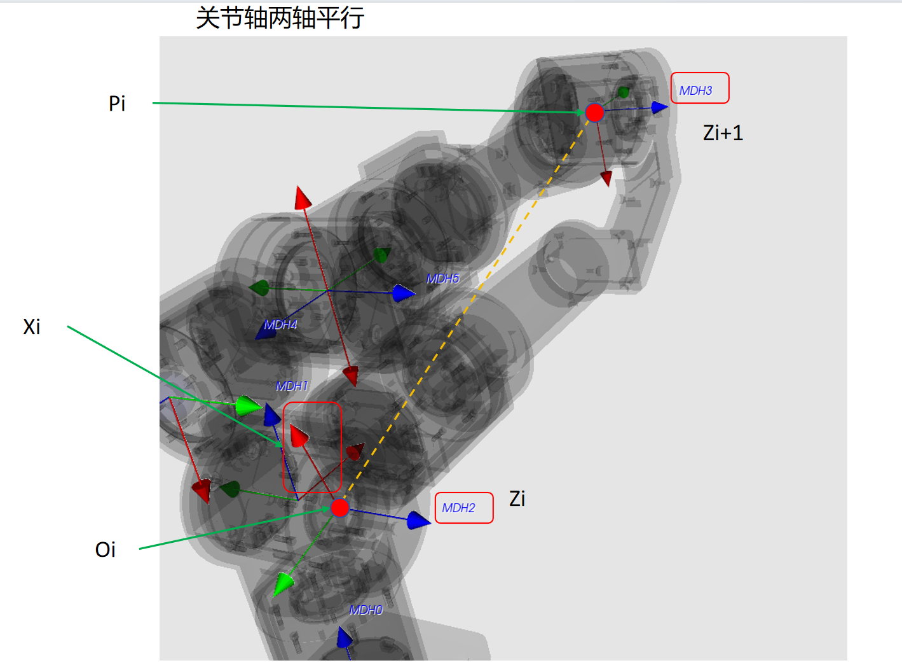

# MDH (Modified Denavit-Hartenberg) 参数教程

## 目录

1. [简介](#简介)
2. [MDH参数定义](#mdh参数定义)
3. [坐标系建立规则](#坐标系建立规则)
4. [MDH参数计算](#mdh参数计算)
5. [特殊情况处理](#特殊情况处理)
6. [第一个和最后一个连杆的特殊性](#第一个和最后一个连杆的特殊性)
7. [从URDF到MDH的转换](#从urdf到mdh的转换)
8. [代码实现详解](#代码实现详解)
9. [示例与验证](#示例与验证)

## 简介

Modified Denavit-Hartenberg (MDH) 参数是机器人学中描述串联机械臂运动学的一种标准方法。与标准DH参数相比，MDH参数在坐标系的定义上有所不同，使得某些情况下的建模更加方便。

本教程基于 `urdf_parser.py` 中的 `get_mdh_parameters` 函数实现，详细介绍如何从URDF文件中提取MDH参数。

## MDH参数定义

MDH参数使用四个参数来描述相邻两个关节之间的变换关系：

| 参数 | 符号 | 描述 |
|------|------|------|
| **θ (theta)** | θᵢ | 绕Zᵢ轴，从Xᵢ₋₁转到Xᵢ的角度 |
| **d** | dᵢ | 沿Zᵢ轴，从Xᵢ₋₁到Xᵢ的距离 |
| **a** | aᵢ₋₁ | 沿Xᵢ₋₁轴，从Zᵢ₋₁到Zᵢ的距离 |
| **α (alpha)** | αᵢ₋₁ | 绕Xᵢ₋₁轴，从Zᵢ₋₁转到Zᵢ的角度 |

### MDH变换矩阵

从坐标系{i-1}到坐标系{i}的变换矩阵为：

```
T(i-1,i) = Rot_z(θᵢ) × Trans_z(dᵢ) × Trans_x(aᵢ₋₁) × Rot_x(αᵢ₋₁)
```

展开后的4×4变换矩阵为：

```
[ cos(θᵢ)              -sin(θᵢ)             0              aᵢ₋₁        ]
[ sin(θᵢ)cos(αᵢ₋₁)    cos(θᵢ)cos(αᵢ₋₁)   -sin(αᵢ₋₁)    -sin(αᵢ₋₁)dᵢ ]
[ sin(θᵢ)sin(αᵢ₋₁)    cos(θᵢ)sin(αᵢ₋₁)    cos(αᵢ₋₁)     cos(αᵢ₋₁)dᵢ  ]
[ 0                    0                    0              1           ]
```

## 坐标系建立规则

### 基本原则

1. **Z轴定义**：Zᵢ轴沿着关节i+1的旋转轴
2. **原点定义**：坐标系{i}的原点Oᵢ位于Zᵢ和Zᵢ₊₁的公垂线与Zᵢ的交点
3. **X轴定义**：Xᵢ轴沿着Zᵢ和Zᵢ₊₁的公垂线，从Zᵢ指向Zᵢ₊₁

### 两轴关系的四种情况

根据相邻两个Z轴（Zᵢ和Zᵢ₊₁）的空间关系，可分为四种情况：

#### 情况1：两轴重合 (Coincident)

- **特征**：Zᵢ和Zᵢ₊₁在同一直线上
- **原点选择**：可任意选择在轴上
- **X轴选择**：垂直于Z轴即可，方向任意

#### 情况2：两轴相交 (Intersect)

- **特征**：Zᵢ和Zᵢ₊₁相交于一点
- **原点选择**：选在交点处
- **X轴选择**：Xᵢ = (Zᵢ × Zᵢ₊₁) / |Zᵢ × Zᵢ₊₁|

#### 情况3：两轴平行 (Parallel)

- **特征**：Zᵢ和Zᵢ₊₁平行但不重合
- **原点选择**：直接选择Zᵢ的原点（从urdf中获取）为$O_i$

- **X轴选择**：从$O_i$找到两平行轴间最短线段与$Z_i+1$的交点为$P_i$。然后Xi的方向由$Z_i\times (P_i - O_i)$决定。

示意图如下：



#### 情况4：两轴异面 (Skew)

- **特征**：Zᵢ和Zᵢ₊₁既不平行也不相交
- **原点选择**：公垂线与Zᵢ的交点
- **X轴选择**：Xᵢ = (Zᵢ × Zᵢ₊₁) / |Zᵢ × Zᵢ₊₁|

## MDH参数计算

### 计算步骤

1. **确定所有关节的Z轴方向和位置**

   ```python
   # 从URDF中提取关节轴向量和位置
   joint_positions, joint_vectors = extract_joint_info(urdf)
   ```

2. **建立MDH坐标系原点**

   ```python
   # 对于每对相邻关节，计算MDH原点
   for i in range(num_joints):
       oi = calculate_mdh_origin(zi, zi_next, pi, pi_next)
   ```

3. **确定X轴方向**

   ```python
   # 根据两轴关系确定X轴
   if case == 'intersect' or case == 'skew':
       xi = cross(zi, zi_next) / norm(cross(zi, zi_next))
   elif case == 'parallel':
       xi = cross(zi, perpendicular_vector) / norm(...)
   ```

4. **计算MDH参数**

   **θ (theta) - 关节角度**：

   ```python
   # 将xi-1和xi投影到垂直于zi的平面上
   p_prev = x_prev - dot(x_prev, zi) * zi
   pi = xi - dot(xi, zi) * zi
   
   # 计算有向角度
   cos_theta = dot(p_prev_norm, pi_norm)
   sin_theta = dot(cross(p_prev_norm, pi_norm), zi)
   theta = atan2(sin_theta, cos_theta)
   ```

   **d - 连杆偏移**：

   ```python
   # 沿zi轴从oi-1到oi的距离
   d = dot(oi - o_prev, zi)
   ```

   **a - 连杆长度**：

   ```python
   # 沿xi-1轴从zi-1到zi的距离
   a = dot(oi - o_prev, x_prev)
   ```

   **α (alpha) - 连杆扭转**：

   ```python
   # 将zi-1和zi投影到垂直于xi-1的平面上
   p_prev = z_prev - dot(z_prev, x_prev) * x_prev
   pi = zi - dot(zi, x_prev) * x_prev
   
   # 计算有向角度
   cos_alpha = dot(p_prev_norm, pi_norm)
   sin_alpha = dot(cross(p_prev_norm, pi_norm), x_prev)
   alpha = atan2(sin_alpha, cos_alpha)
   ```

## 特殊情况处理

### 公垂线计算

对于不同的轴关系，公垂线的计算方法不同：

```python
def calculate_common_perpendicular(zi, zi_next, pi, pi_next):
    # 异面直线情况
    if skew:
        n = cross(zi, zi_next) / norm(cross(zi, zi_next))
        # 求解线性方程组
        A = column_stack((zi, -zi_next, n))
        b = pi_next - pi
        t, s, _ = lstsq(A, b)
        point1 = pi + t * zi
        point2 = pi_next + s * zi_next
        return (point1, point2)
    
    # 平行线情况
    elif parallel:
        perpendicular_vec = cross(zi, cross(pi_next - pi, zi))
        perpendicular_vec = perpendicular_vec / norm(perpendicular_vec)
        point1 = pi
        point2 = pi_next - dot(pi_next - pi, zi) * zi
        return (point1, point2)
```

## 第一个和最后一个连杆的特殊性

### 重要说明

**在MDH参数系统中，第一个连杆（基座）和最后一个连杆（末端执行器）的坐标系定义具有一定的任意性。**

### 第一个连杆（Link 0 / Base）

对于第一个连杆：

- **Z₀轴**：通常选择为垂直向上（[0, 0, 1]），但这不是唯一选择
- **X₀轴**：可以任意选择，只要垂直于Z₀
- **原点O₀**：通常选在基座中心，但也可以根据需要调整

**任意性的原因**：

- 第一个连杆没有"前一个"关节来约束其坐标系
- 不同的选择会影响第一组MDH参数，但不影响机器人的实际运动学

### 最后一个连杆（Link n / End-Effector）

对于最后一个连杆：

- **Zₙ轴**：沿最后一个关节的旋转轴
- **Xₙ轴**：由于没有"下一个"关节，X轴的选择具有任意性
- **原点Oₙ**：通常选在末端执行器的工作点

**任意性的原因**：

- 最后一个连杆没有"下一个"关节来形成公垂线
- X轴可以根据末端执行器的工作需求来选择

### 实际应用中的处理

```python
def get_mdh_parameters(chain):
    # ... 前面的计算 ...
    
    # 第一个关节的特殊处理
    if i == 0:
        # Z轴默认为基座的Z轴方向
        mdh_zs.append([0, 0, 1])  # 可以根据需要调整
        # X轴可以选择为基座的X轴方向
        mdh_xs.append([1, 0, 0])  # 任意但需垂直于Z
    
    # 最后一个关节的特殊处理
    if i == num_joints - 1:
        mdh_origins.append(joint_positions[-1])
        mdh_zs.append(joint_vectors[-1])
        # X轴继承前一个关节的X轴方向或根据应用需求选择
        mdh_xs.append(joint_xs[-1])  # 可以根据需要调整
```

## 从URDF到MDH的转换

### 转换流程

1. **解析URDF文件**
   - 提取所有连杆(links)和关节(joints)信息
   - 建立运动链(kinematic chain)

2. **提取关节信息**
   - 关节位置（从origin的xyz）
   - 关节轴向量（从axis的xyz）
   - 关节类型（revolute, prismatic, fixed等）

3. **过滤固定关节**
   - MDH参数只考虑活动关节（revolute和prismatic）
   - 固定关节不参与MDH参数计算

4. **计算MDH参数**
   - 按照上述规则建立坐标系
   - 计算四个MDH参数

### 代码示例

```python
class URDFParser:
    def get_mdh_parameters(self, chain):
        # 获取关节信息
        joint_positions, joint_vectors, joint_xs, joint_types = self.get_joint_axes(chain)
        
        # 过滤固定关节
        active_positions = [pos for i, pos in enumerate(joint_positions) 
                          if joint_types[i] in ['revolute', 'base']]
        active_vectors = [vec for i, vec in enumerate(joint_vectors) 
                        if joint_types[i] in ['revolute', 'base']]
        
        mdh_parameters = []
        
        for i in range(num_joints):
            # 计算MDH原点
            oi, case, _ = self.calculate_mdh_origin_position(
                joint_pos, joint_vector, joint_pos_next, joint_vector_next
            )
            
            # 确定X轴方向
            if case == 'coincident':
                xi = joint_x  # 使用原始X轴
            elif case in ['skew', 'intersect']:
                xi = np.cross(joint_vector, joint_vector_next)
                xi = xi / np.linalg.norm(xi)
            elif case == 'parallel':
                xi = np.cross(joint_vector, perpendicular_direction)
                xi = xi / np.linalg.norm(xi)
            
            # 计算MDH参数
            theta = calculate_theta(x_prev, xi, zi)
            d = calculate_d(o_prev, oi, zi)
            a = calculate_a(o_prev, oi, x_prev)
            alpha = calculate_alpha(z_prev, zi, x_prev)
            
            mdh_parameters.append([theta, d, a, alpha])
        
        return mdh_parameters
```

## 代码实现详解

### 关键函数解析

#### 1. `calculate_mdh_origin_position`

此函数确定MDH坐标系的原点位置：

```python
def calculate_mdh_origin_position(self, joint_pos, joint_vector, 
                                 joint_pos_next, joint_vector_next):
    """
    计算相邻两个关节坐标系原点oi的位置
    
    返回:
        oi: 坐标系原点位置
        case: 情况分类 ('coincident', 'intersect', 'parallel', 'skew')
        common_perpendicular: 公垂线信息
    """
    
    # 检查两轴是否平行
    if np.allclose(np.cross(zi, zi_next), np.zeros(3)):
        # 检查是否重合
        if on_same_line(zi, zi_next, pi, pi_next):
            return pi, 'coincident', None
        else:
            # 平行但不重合
            return calculate_parallel_case()
    
    # 检查是否相交
    distance = calculate_line_distance(zi, zi_next, pi, pi_next)
    if np.isclose(distance, 0):
        # 相交，找交点
        intersection = find_intersection(zi, zi_next, pi, pi_next)
        return intersection, 'intersect', (intersection, intersection)
    
    # 异面直线
    return calculate_skew_case()
```

#### 2. 角度计算的有向性

计算角度时需要考虑旋转的方向：

```python
def calculate_angle(v1, v2, axis):
    """
    计算从v1到v2绕axis轴的有向角度
    """
    # 投影到垂直于轴的平面
    v1_proj = v1 - np.dot(v1, axis) * axis
    v2_proj = v2 - np.dot(v2, axis) * axis
    
    # 归一化
    v1_norm = v1_proj / np.linalg.norm(v1_proj)
    v2_norm = v2_proj / np.linalg.norm(v2_proj)
    
    # 计算有向角度
    cos_angle = np.dot(v1_norm, v2_norm)
    sin_angle = np.dot(np.cross(v1_norm, v2_norm), axis)
    
    return np.arctan2(sin_angle, cos_angle)
```

## 示例与验证

### 示例1：简单2自由度机械臂

```python
# URDF定义的关节
joints = [
    {"name": "joint1", "type": "revolute", "axis": [0, 0, 1], 
     "origin": {"xyz": [0, 0, 0.1], "rpy": [0, 0, 0]}},
    {"name": "joint2", "type": "revolute", "axis": [0, 0, 1], 
     "origin": {"xyz": [0.5, 0, 0], "rpy": [0, 0, 0]}}
]

# 计算得到的MDH参数
mdh_parameters = [
    [0, 0.1, 0.5, 0],  # joint1: θ₁=0, d₁=0.1, a₀=0.5, α₀=0
    [0, 0, 0, 0]       # joint2: θ₂=0, d₂=0, a₁=0, α₁=0
]
```

### 示例2：验证MDH参数

使用roboticstoolbox验证计算的MDH参数：

```python
import roboticstoolbox as rtb
import numpy as np

# 从计算得到的MDH参数创建机器人模型
mdh_config = []
for params in mdh_parameters:
    theta, d, a, alpha = params
    mdh_config.append(rtb.RevoluteMDH(d=d, a=a, alpha=alpha, offset=theta))

robot = rtb.DHRobot(mdh_config, name="test_robot")

# 计算正向运动学
q = [0.1, 0.2, 0.3, 0.4, 0.5, 0.6, 0.7]  # 关节角度
T = robot.fkine(q)

# 与原始URDF的正向运动学结果对比
print("MDH Forward Kinematics:")
print("Position:", T.t)
print("Orientation:", T.R)
```

### 验证检查清单

1. ✅ 所有MDH参数的单位是否一致（角度用弧度，长度用米）
2. ✅ 第一个和最后一个连杆的坐标系是否合理定义
3. ✅ 正向运动学结果是否与URDF原始定义一致
4. ✅ 关节限位是否正确考虑
5. ✅ 固定关节是否正确过滤

## 常见问题与解决方案

### Q1: 为什么第一个和最后一个连杆的X轴选择不唯一？

**答**：因为MDH参数的定义依赖于相邻两个Z轴的关系。第一个连杆没有"前一个"Z轴，最后一个连杆没有"后一个"Z轴，因此它们的X轴选择具有自由度。这种任意性不影响机器人的运动学，只是改变了参考坐标系的定义。

### Q2: 如何选择合适的基座和末端坐标系？

**答**：

- **基座坐标系**：通常选择Z轴垂直向上，X轴指向机器人的"前方"
- **末端坐标系**：根据具体应用选择，例如夹爪的Z轴沿夹持方向，X轴沿手指开合方向

### Q3: MDH参数与标准DH参数的区别？

**答**：

- **坐标系位置**：MDH将坐标系{i}放在关节i的输出端，标准DH放在输入端
- **参数定义顺序**：MDH使用(θ, d, a, α)的顺序，标准DH使用(a, α, d, θ)
- **适用场景**：MDH在处理某些特殊构型时更方便

### Q4: 如何处理棱柱关节（prismatic joint）？

**答**：棱柱关节的处理类似于旋转关节，但是：

- d参数成为关节变量（而不是θ）
- 需要在MDH参数表中标记关节类型

## 参考资料

1. Craig, J. J. (2005). *Introduction to Robotics: Mechanics and Control* (3rd ed.)
2. Khalil, W., & Dombre, E. (2002). *Modeling, Identification and Control of Robots*
3. [Modified DH Parameters - Wikipedia](https://en.wikipedia.org/wiki/Denavit%E2%80%93Hartenberg_parameters#Modified_DH_parameters)
4. [Robotics Toolbox for Python Documentation](https://petercorke.github.io/robotics-toolbox-python/)

## 总结

MDH参数提供了一种系统化的方法来描述串联机械臂的运动学。通过本教程，您应该能够：

1. 理解MDH参数的定义和物理意义
2. 掌握从URDF到MDH参数的转换方法
3. 理解第一个和最后一个连杆坐标系的特殊性
4. 能够验证计算得到的MDH参数的正确性

记住，MDH参数的计算虽然有标准流程，但在实际应用中需要根据具体情况灵活处理，特别是对于第一个和最后一个连杆的坐标系定义。
